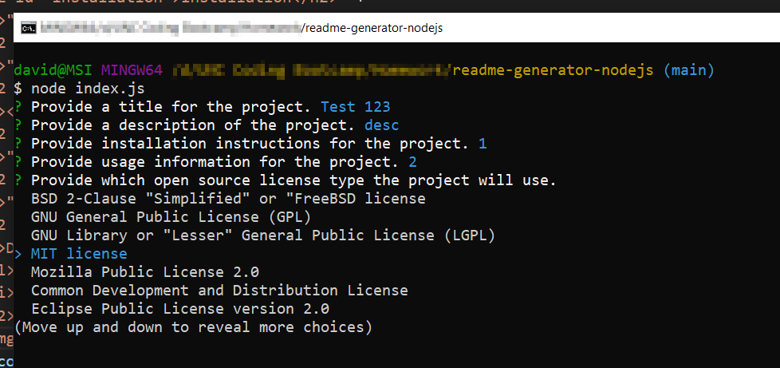

<h1>README Generator Node.js</h1><h2>Description</h2>

A node.js based command line utility program that takes input from users based on the criteria (https://coding-boot-camp.github.io/full-stack/github/professional-readme-guide) of a professional README.md and outputs a formatted file. It uses the built in file system library for node and npm package inquirer. This README.md file you are reading is an example of the output of the program.
<h2>Table of Contents</h2><ul><li><a href='#installation'>Installation</a></li><li><a href='#usage'>Usage</a></li><li><a href='#license'>License</a></li><li><a href='#contributing'>Contributing</a></li><li><a href='#tests'>Tests</a></li><li><a href='#questions'>Questions</a></li></ul><h2 id='installation'>Installation</h2>
Prerequisite: Node.js is installed. To install first clone down the repo via command prompt.  Then while in the same directory run `npm install` to pull down the required dependencies. Then run via console by navigating to the directory where the project was cloned and using the command `node index.js`.
<h2 id='usage'>Usage</h2>
Enter the information requested in each of the command prompts and a file with the name given in the `fileName` variable (Default: README.md) will be generated in the same directory. 
<h2 id='license'>License</h2>
<a href='https://opensource.org/licenses/Apache-2.0'>Apache License 2.0</a>
<h2 id='contributing'>Contributing</h2>
If you are interested in contributing to this project feel free to create a pull request.
<h2 id='tests'>Tests</h2>
Manual testing was done to check various types of user input and ensuring that it renders the README.md file correctly via HTML on GitHub.
<h2 id='questions'>Questions</h2>
Do you have any questions or comments?
<ul><li>GitHub Profile: <a href='https://github.com/DavidTunnell'>DavidTunnell</a></li><li>Email: <a href='mailto: sample-email@gmail.com'>sample-email@gmail.com</a></li></ul><h2>Screenshot</h2>